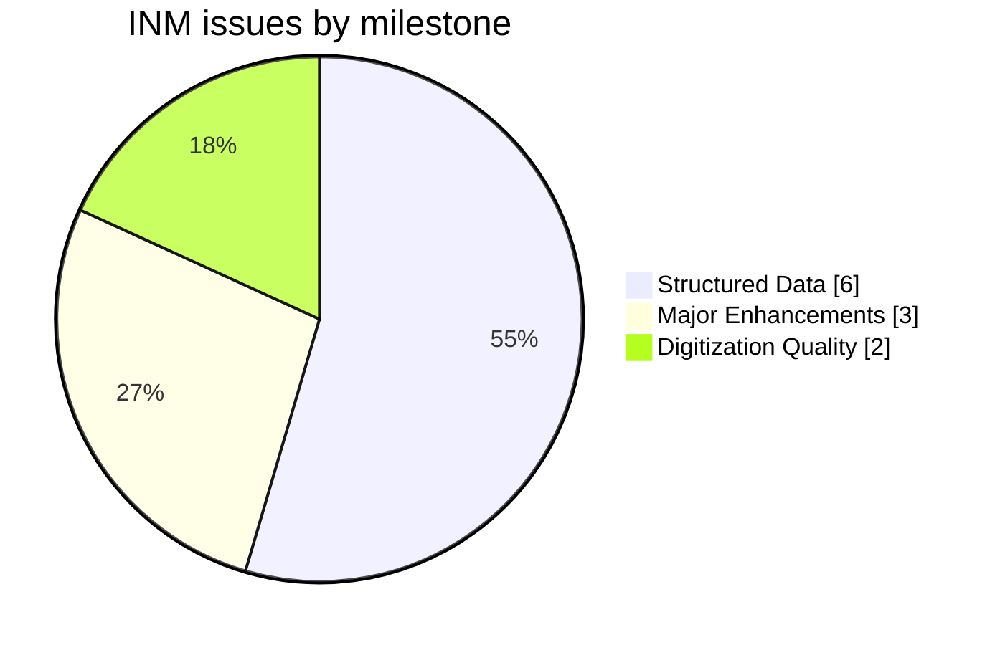
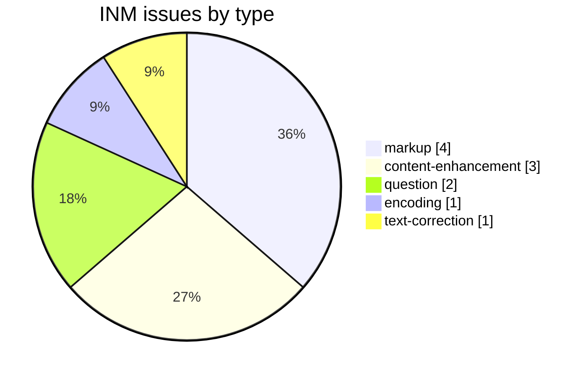
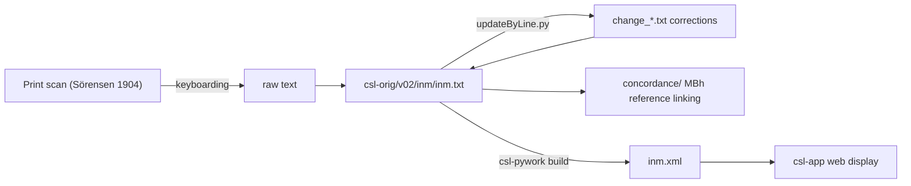

# INM — Sörensen *Index to the Names in the Mahābhārata*

Development and correction repository for **S. Sörensen's *An Index to the Names in the Mahābhārata* (1904)**, a specialized English-language onomastic index, part of the [Cologne Digital Sanskrit Lexicon](https://www.sanskrit-lexicon.uni-koeln.de/) (CDSL). The canonical source text lives in [`csl-orig/v02/inm/inm.txt`](https://github.com/sanskrit-lexicon/csl-orig/blob/master/v02/inm/inm.txt) (12,647 entries); this repository holds correction and enrichment work (concordance, Greek-text, spaced-markup research).

## Documentation

- [CLAUDE.md](CLAUDE.md) — repository guide, correction workflow, and data-format reference.

## Contents

| Path | Purpose |
|---|---|
| `concordance/` | Concordance data linking INM entries to Mahābhārata text references |
| `greek/` | Greek loanword / citation research |
| `spacedmarkup/` | Research on spaced-markup conventions in INM entries |
| `CITATION.cff` | Machine-readable citation metadata |

## Timeline

| Period | Activity |
|---|---|
| 2021-12 | Repository initialized; markup normalization |
| 2022-05 – 2022-06 | Greek text, concordance work |
| 2026-05 | Issue taxonomy, citation metadata, documentation |

## Projects & Milestones

| Milestone | Open | Closed | Total |
|---|---|---|---|
| Dictionary to Book | 0 | 0 | 0 |
| Digitization Quality | 1 | 1 | 2 |
| Structured Data | 1 | 5 | 6 |
| Major Enhancements | 1 | 2 | 3 |
| **Total** | **3** | **8** | **11** |

## Issues

### Open

| # | Title | Type | Severity | Milestone |
|---|---|---|---|---|
| 1 | INM Concordance | content-enhancement | medium | Major Enhancements |
| 8 | Space Missing (1000 names2 → 1000 names 2) | text-correction | minor | Digitization Quality |
| 11 | docs-pass: INM documentation review | question | minor | Structured Data |

### Solved

| # | Title | Type | Severity | Milestone |
|---|---|---|---|---|
| 2 | Separate inm.txt into parts | content-enhancement | medium | Major Enhancements |
| 3 | Transcoding Bug? | encoding | minor | Digitization Quality |
| 4 | Greek text added | content-enhancement | medium | Major Enhancements |
| 5 | INM widely spaced text | markup | minor | Structured Data |
| 6 | Punctuation at end of bold, italic | markup | minor | Structured Data |
| 7 | Remove `
` | markup | minor | Structured Data |
| 9 | Greek text remove lang tag | question | minor | Structured Data |
| 10 | [markup] Minor inm.txt Markup Oddities | markup | minor | Structured Data |

## Labels

### Type labels
| Label | Meaning |
|---|---|
| `link-target` | Click-throughs from `<ls>` abbreviations to scanned PDF pages |
| `link-splitting` | Splitting combined `SOURCE N,N` refs into per-page links |
| `markup` | Normalising XML tag content |
| `text-correction` | Corrections to English definitions or Sanskrit headwords |
| `content-enhancement` | New material or structural additions beyond correction |
| `encoding` | SLP1/IAST transcoding, character normalisation |
| `scan-quality` | Replacing blurry/skewed/missing scan pages |
| `bug` | Broken links, XML errors, broken downloads |
| `question` | Scholarly questions requiring research |

### Severity labels
| Label | Meaning |
|---|---|
| `minor` | Targeted fix — a handful of lines or a single file |
| `medium` | Standard unit of work — one batch of corrections |
| `hard` | Large effort spanning many sources or files |

## Contributors

| Contributor | Commits |
|---|---|
| funderburkjim | 7 |
| Mārcis Gasūns | 2 |

## Source

- **Author**: Sörensen, Sören
- **Title**: *An Index to the Names in the Mahābhārata*
- **Place / Publisher**: London: Williams & Norgate
- **Year**: 1904
- **Language**: English (onomastic index of Sanskrit proper names)
- **Entries (digital edition)**: 12,647
- **License (digital edition)**: CC BY-SA 4.0
- See [CITATION.cff](CITATION.cff) for machine-readable citation.

## Encoding

- UTF-8 (NFC) throughout.
- Proper names and reference numbers in bold (`{@…@}`); italic display text in ``; section references marked `§`.
- Mahābhārata references are encoded as parvan/chapter/line citations within entries.
- Devanāgarī and IAST are generated at display time, not stored in the source.

## How it works

---
*Issue taxonomy and documentation per the [Cologne issue runbook](https://github.com/sanskrit-lexicon/csl-observatory/blob/main/runbook/cologne-issue-runbook.md).*
