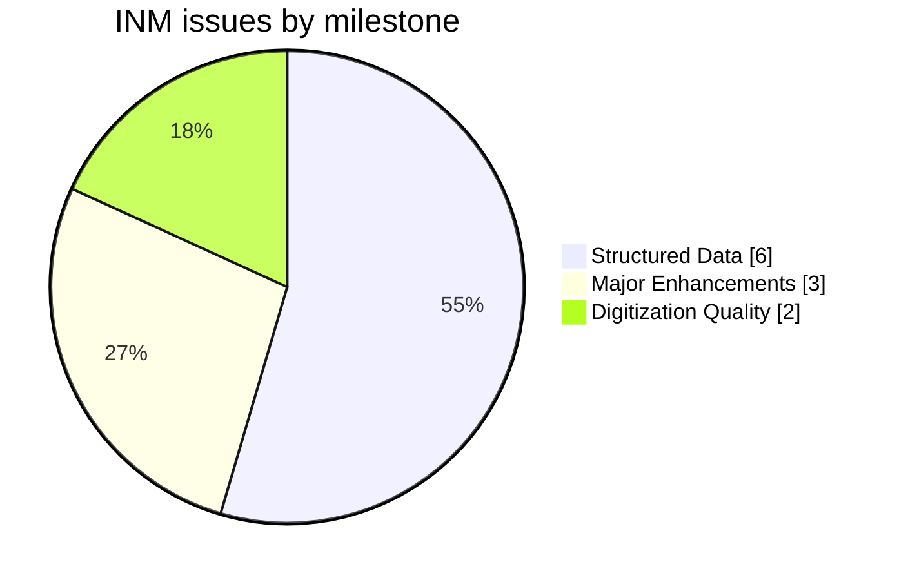
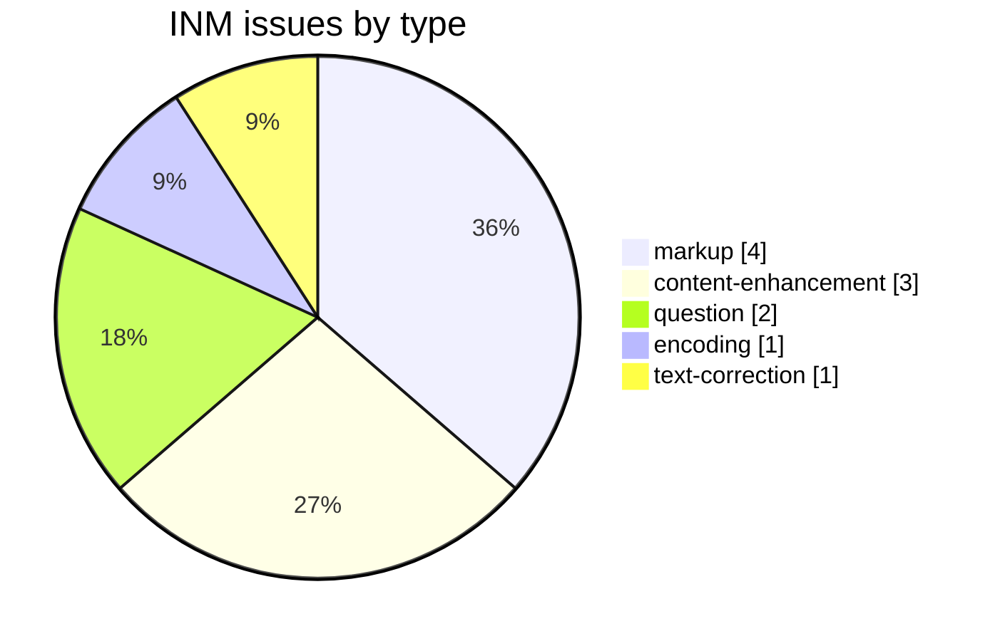
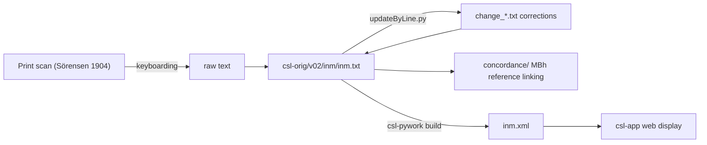

# INM — Sörensen *Index to the Names in the Mahābhārata*

Development and correction repository for **S. Sörensen's *An Index to the Names in the Mahābhārata* (1904)**, a specialized English-language onomastic index, part of the [Cologne Digital Sanskrit Lexicon](https://www.sanskrit-lexicon.uni-koeln.de/) (CDSL). The canonical source text lives in [`csl-orig/v02/inm/inm.txt`](https://github.com/sanskrit-lexicon/csl-orig/blob/master/v02/inm/inm.txt) (12,647 entries); this repository holds correction and enrichment work (concordance, Greek-text, spaced-markup research).

## Documentation

- [CLAUDE.md](CLAUDE.md) — repository guide, correction workflow, and data-format reference.

## Contents

| Path | Purpose |
|---|---|
| `prefaces/` | Front-matter OCR (title page, Foreword, Preface, List of Abbreviations, Postscriptum) with Russian translation — see [Front matter](#front-matter-prefaces) below |
| `concordance/` | Concordance data linking INM entries to Mahābhārata text references |
| `greek/` | Greek loanword / citation research |
| `spacedmarkup/` | Research on spaced-markup conventions in INM entries |
| `CITATION.cff` | Machine-readable citation metadata |

## Front matter (`prefaces/`)

Faithful OCR of the 9 front-matter scan pages — the title page and publisher imprint of the 1963 Motilal Banarsidass reprint, the reprint *Foreword* (R. P. Naik, Ministry of Education), Sörensen's original *Preface* (pp. iii–vi, signed *“S. Sörensen. Copenhagen. February, 1902”*), the *List of Abbreviations*, and the *Postscriptum* (Dines Andersen & Elof Olesen, Copenhagen, January 1925, recording the author's death on 8 December 1902 and how the work was completed posthumously) — each in the **English source** plus a **Russian** translation, with consolidated single-file editions and a [`prefaces/README.md`](prefaces/README.md) index. Source: the Cologne [csldoc preface scans](https://sanskrit-lexicon.uni-koeln.de/scans/csldev/csldoc/build/dictionaries/prefaces/inmpref.html). Because the source is already English there are no per-page `.en.md` files (the base `.md` *is* the English edition); the consolidated outputs are [`inmpref_all.en.md`](prefaces/inmpref_all.en.md) and [`inmpref_all.ru.md`](prefaces/inmpref_all.ru.md). Sörensen's transliteration (palatal *ç*, *sh*, vocalic *ṛ*, clarendon chapter numbers) and all Devanāgarī/Sanskrit are kept verbatim; the digitizer header/footer stamps are omitted.

<strong>OCR run notes (2026-06-22)</strong> — cost, timing, and technical lessons

Produced by the `/cologne-preface-ocr` skill, run **synchronously in the main thread** (no subagents) per the preface-retry rules.

**Cost.** Single-thread main context only: ~14 native-resolution image-crop Reads across 5 fresh pages (06–09 plus re-verification), 9 page transcriptions already on disk reused, 9 Russian translations authored, plus the consolidated build + README work. **Total ≈180–220k tokens.**

**Time.** Wall-clock ≈8–12 min, fully sequential.

**Technical lessons (reusable):**

1. **INM's csldoc scans are high-resolution `.png` (3328×4677).** Native-resolution crop bands at ≤1900 px read cleanly; no upscaling needed.
2. **The scan sequence has a gap and a reordering.** Underlying pages run 808–817 with **812 absent**; scan **808** is the *Postscriptum* and is ordered **last** (page 09), not first — the csldoc toctree order is authoritative, not filename sort.
3. **The source is the 1963 Motilal Banarsidass reprint**, so the title page / imprint / Foreword are reprint-era (1963), while the Preface (1902) and Postscriptum (1925) are from the original Williams & Norgate edition.
4. **The List of Abbreviations is 3 print columns** — transcribed in reading order (col 1 → 2 → 3) and split into two Markdown tables (abbreviations, symbols).
5. **Encoding.** All `.md` files written UTF-8 **no BOM** (verified: `inmpref_all.*` start `23 20 46` / `23 20 d0`, not `efbbbf`).
6. **Resume-aware.** Pages 01–05 from a prior partial run were reused unchanged; only 06–09 + all translations + consolidation were new.

## Timeline

| Period | Activity |
|---|---|
| 2021-12 | Repository initialized; markup normalization |
| 2022-05 – 2022-06 | Greek text, concordance work |
| 2026-05 | Issue taxonomy, citation metadata, documentation |
| 2026-06 | Front-matter OCR + Russian translation of the 1904/1963 prefaces (`prefaces/`) |

## Projects & Milestones

| Milestone | Open | Closed | Total |
|---|---|---|---|
| Dictionary to Book | 0 | 0 | 0 |
| Digitization Quality | 1 | 1 | 2 |
| Structured Data | 1 | 5 | 6 |
| Major Enhancements | 1 | 2 | 3 |
| **Total** | **3** | **8** | **11** |

## Issues

### Open

| # | Title | Type | Severity | Milestone |
|---|---|---|---|---|
| 1 | INM Concordance | content-enhancement | medium | Major Enhancements |
| 8 | Space Missing (1000 names2 → 1000 names 2) | text-correction | minor | Digitization Quality |
| 11 | docs-pass: INM documentation review | question | minor | Structured Data |

### Solved

| # | Title | Type | Severity | Milestone |
|---|---|---|---|---|
| 2 | Separate inm.txt into parts | content-enhancement | medium | Major Enhancements |
| 3 | Transcoding Bug? | encoding | minor | Digitization Quality |
| 4 | Greek text added | content-enhancement | medium | Major Enhancements |
| 5 | INM widely spaced text | markup | minor | Structured Data |
| 6 | Punctuation at end of bold, italic | markup | minor | Structured Data |
| 7 | Remove `
` | markup | minor | Structured Data |
| 9 | Greek text remove lang tag | question | minor | Structured Data |
| 10 | [markup] Minor inm.txt Markup Oddities | markup | minor | Structured Data |

## Labels

### Type labels
| Label | Meaning |
|---|---|
| `link-target` | Click-throughs from `<ls>` abbreviations to scanned PDF pages |
| `link-splitting` | Splitting combined `SOURCE N,N` refs into per-page links |
| `markup` | Normalising XML tag content |
| `text-correction` | Corrections to English definitions or Sanskrit headwords |
| `content-enhancement` | New material or structural additions beyond correction |
| `encoding` | SLP1/IAST transcoding, character normalisation |
| `scan-quality` | Replacing blurry/skewed/missing scan pages |
| `bug` | Broken links, XML errors, broken downloads |
| `question` | Scholarly questions requiring research |

### Severity labels
| Label | Meaning |
|---|---|
| `minor` | Targeted fix — a handful of lines or a single file |
| `medium` | Standard unit of work — one batch of corrections |
| `hard` | Large effort spanning many sources or files |

## Contributors

| Contributor | Commits |
|---|---|
| funderburkjim | 7 |
| Mārcis Gasūns | 2 |

## Source

- **Author**: Sörensen, Sören
- **Title**: *An Index to the Names in the Mahābhārata*
- **Place / Publisher**: London: Williams & Norgate
- **Year**: 1904
- **Language**: English (onomastic index of Sanskrit proper names)
- **Entries (digital edition)**: 12,647
- **License (digital edition)**: CC BY-SA 4.0
- See [CITATION.cff](CITATION.cff) for machine-readable citation.

## Encoding

- UTF-8 (NFC) throughout.
- Proper names and reference numbers in bold (`{@…@}`); italic display text in ``; section references marked `§`.
- Mahābhārata references are encoded as parvan/chapter/line citations within entries.
- Devanāgarī and IAST are generated at display time, not stored in the source.

## How it works

---
*Issue taxonomy and documentation per the [Cologne issue runbook](https://github.com/sanskrit-lexicon/csl-observatory/blob/main/runbook/cologne-issue-runbook.md).*
